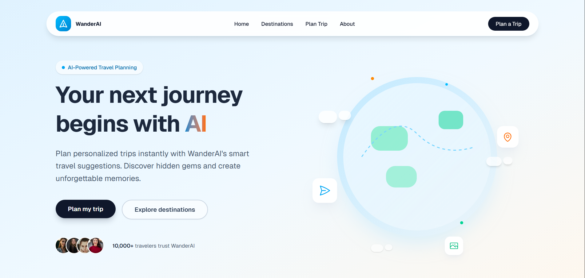

# 🌍 WanderAI – AI-Powered Smart Travel Planning Landing Page



**A modern, responsive, and visual landing page** for an AI-driven travel planning service — built as a frontend evaluation task showcasing clean architecture, mobile-first design, and intelligent use of cutting-edge tools.

🚀 **Live Demo:** [https://wanderai-psi.vercel.app](https://wanderai-psi.vercel.app)  
📂 **GitHub Repository:** [https://github.com/saumyakant4421/wanderai](https://github.com/saumyakant4421/wanderai)

---

## ✨ Features

- Sky-inspired gradient hero with compelling headline & CTAs  
- Feature-rich section highlighting AI-powered itinerary creation, real-time suggestions, and personalized recommendations  
- Beautiful testimonial carousel with traveler quotes  
- Transparent pricing tiers with clear value differentiation  
- Fully responsive design (mobile → desktop)  
- Smooth micro-animations powered by Framer Motion  
- Accessible, semantic HTML with Shadcn UI components  

---

## 🛠️ Tech Stack

| Technology         | Purpose                              |
|--------------------|--------------------------------------|
| Next.js (App Router) | Modern React framework + SSR         |
| React 19           | Latest React features & performance  |
| Tailwind CSS       | Utility-first styling                |
| Shadcn/UI          | Beautiful, accessible components     |
| Framer Motion      | Subtle, elegant animations           |
| **Vercel v0**      | AI-powered UI generation (core task requirement) |
| Vercel             | Hosting & instant deployment         |

---

## 🧩 How Vercel v0 Was Used (Task Requirement ✓)

Vercel v0 played a central role in rapid prototyping:

| Section              | Generated with v0? | Post-Generation Refinements                     |
|----------------------|--------------------|-------------------------------------------------|
| Hero Section         | Yes                 | Spacing, mobile CTA stack, animation timing    |
| Features Section     | Yes                 | Card alignment, icon integration, hover effects |
| Testimonials         | Yes                 | Carousel behavior, responsive quote sizing     |
| Pricing Section      | Yes                 | Tier highlighting, button styles, mobile layout |
| Footer               | Yes                 | Link grouping, social icons, subtle gradient   |

All v0-generated components were manually polished for consistency, performance, and pixel-perfect responsiveness.

---

## 📁 Project Structure

```
/
├── app/
│   ├── page.tsx          # Main landing page
│   ├── layout.tsx        # Root layout + metadata
│   └── globals.css
├── components/
│   ├── hero-section.tsx
│   ├── features-section.tsx
│   ├── testimonials-section.tsx
│   ├── pricing-section.tsx
│   ├── footer.tsx
│   └── ui/               # Shadcn components (button, card, etc.)
├── public/               # Images, icons, favicon
├── lib/                  # Utilities (if any)
├── styles/
├── tailwind.config.js
├── next.config.js
├── package.json
└── README.md
```

---

## 🚀 Getting Started

### 1. Clone the Repository

```bash
git clone https://github.com/yourusername/wanderai.git
cd wanderai
```

### 2. Install Dependencies

```bash
npm install
```

### 3. Run Development Server

```bash
npm run dev
```

Open [http://localhost:3000](http://localhost:3000) in your browser.

### 4. Build for Production

```bash
npm run build
npm run start
```

### 5. Deploy (One-Click on Vercel)

Push to GitHub → Import project on [vercel.com](https://vercel.com) → Instantly live!

---

## 🎨 Design & UX Highlights

- **Soft sky-blue gradient theme** evoking freedom and adventure
- **Generous whitespace** and consistent rhythm
- **Mobile-first breakpoints** with graceful degradation
- **Subtle animations** that enhance without overwhelming

---
